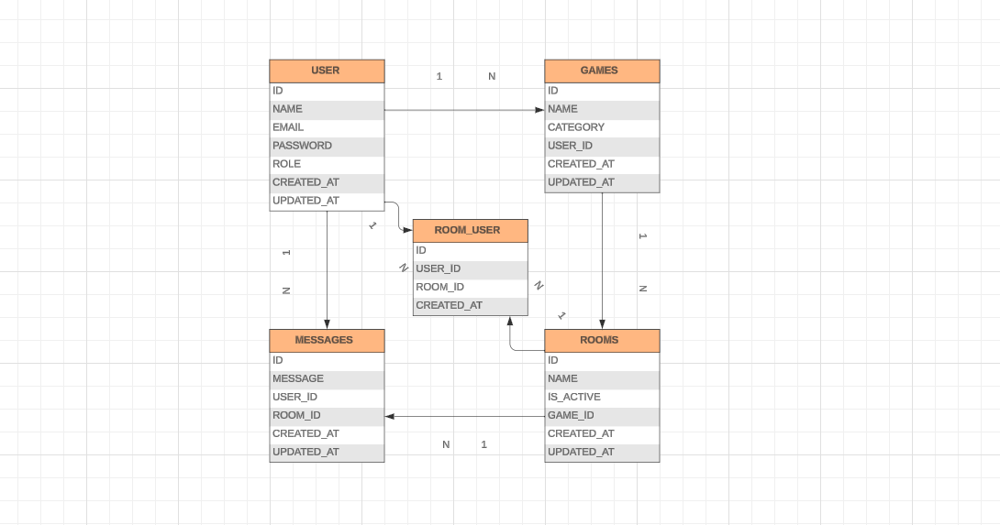

# GeeksHubs  

<a>Proyecto 6- BACKEND ASANGAME 🎮</a>

## Tabla de contenidos

- [Descripción 📝](#Descripción)
- [Tecnologías y Herramientas 🛠️](#Tecnologías-y-Herramientas)
- [Diseño de la BBDD 🗄️](#Diseño-de-la-BBDD)
- [Instrucciones de Uso 🚀](#Instrucciones-de-Uso)
- [Endpoints 🛣️](#Endpoints)
- [Contribuciones  🤝](#Contribuciones)
- [Licencia y Copyright📃](#licencia-y-copyright)


## Descripción 

Backend AsanGames creado por **Ángel Díaz Calleja** y **Sandra Suazo López**  como parte del Bootcamp de Full Stack Developer de Geekshubs

AsanGames ha sido diseñado con la finalidad de recrear un portal de juegos utilizando **PHP, Laravel, mySQL y Postman**. El usuario podrá hacer register, login, editar y eliminar su perfil, así como acceder a información reservada si eres admin -listado de users o citas-, y creación de juegos, salas de juego y mensajes dentro de las mismas. 

## Tecnologías y Herramientas

- **PHP** 
- **LARAVEL** 
- **Postman** 
- **Visual Studio Code** 
- **Github** 
- **Git** 

## Diseño de la BBDD



## Instrucciones de Uso

1. **Clonación del Repositorio**

    Clona este repositorio en local usando el siguiente comando:

    ```bash
    git clone [https://github.com/SandraSuazo/Proyecto06_Backend_Game_PHP]
    ```

2. **Instalación de Dependencias**

    A continuación, instala todas las dependencias con el siguiente comando:

    ```bash
    composer install
    ```

3. **Configuración de la Base de Datos**


    Vincula tu repositorio con la base de datos mediante las credenciales en el archivo de variables de entorno (.env). Asegúrate de ajustar las siguientes variables:

    ```dotenv
    DB_CONNECTION=mysql
    DB_HOST=127.0.0.1
    DB_PORT=3306
    DB_DATABASE=laravel
    DB_USERNAME=root
    DB_PASSWORD=
    ```

4. **Migraciones y Seeders**

    Ejecuta las migraciones con el siguiente comando:

    ```bash
    php artisan migrate
    ```

    Ejecuta los seeders con el siguiente comando:

    ```bash
    php artisan db:seed
    ```
    Ejecuta la aplicación
      ```bash
    php artisan serve
    ```
5. **Explicación usuarios** 
   Asangames ha sido creado con dos tipos de usuarios -users y admin-. Aquí se detallan dos ejemplos con su email y password para posibles pruebas.

     ```bash
     {
    "email":"user@user.com",
    "password":"Whopper"
    }
    ```
      ```bash
     {
    "email":"admin@admin.com",
    "password":"Whopper"
    }
    ```


## Endpoints del Proyecto 

Este Backend está preparado para realizar los siguientes endpoints

**USERS**

<details>
  <summary><strong>REGISTER</strong> <small>[POST]</small></summary>

  | Método |              Endpoint                |           Descripción            |
  |--------|--------------------------------------|-----------------------------------|
  | POST   | `http://localhost:8000/api/register` | Registra al usuario              |

  **Payload de Ejemplo:**
  ```json
  {
      "name": "Nombre del Usuario",
      "email": "correo@ejemplo.com",
      "password": "contraseña del Usuario"
  }
  ```
  **Descripción detallada:**
- Permite registrar al usuario.
- Es necesario cumplir la validación del nombre, email y contraseña para registrarse.
</details>


<details>
  <summary><strong>LOGIN</strong> <small>[POST]</small></summary>

  | Método |              Endpoint                |           Descripción            |
  |--------|--------------------------------------|-----------------------------------|
  | POST   | `http://localhost:8000/api/login`    | Loguea al usuario                |

  **Payload de Ejemplo:**
  ```json
  {
      "email": "correo@ejemplo.com",
      "password": "contraseña del Usuario"
  }
  ```
  **Descripción detallada:**
- Permite al usuario iniciar sesión.
- Es necesario cumplir la validación del email y contraseña para acceder.
</details>

<details>
  <summary><strong>LOGOUT</strong> <small>[POST]</small></summary>

  | Método |              Endpoint                |           Descripción            |
  |--------|--------------------------------------|-----------------------------------|
  | POST   | `http://localhost:8000/api/logout`   | Cierra sesión                     |

  **Descripción detallada:**
- El usuario cierra sesión.

</details>

<details>
  <summary><strong>PROFILE</strong> <small>[GET]</small></summary>

  | Método |              Endpoint                |           Descripción            |
  |--------|--------------------------------------|-----------------------------------|
  | GET    | `http://localhost:8000/api/profile`   | Muestra el perfil                |

  **Descripción detallada:**
  - El usuario accede a su perfil.

</details>

<details>
  <summary><strong>UPDATE-PROFILE</strong> <small>[PUT]</small></summary>

  | Método |              Endpoint                |           Descripción            |
  |--------|--------------------------------------|-----------------------------------|
  | PUT    | `http://localhost:8000/api/user`     | Modifica el perfil               |

  **Payload de Ejemplo:**
  ```json
  {
      "name": "nombreACambiar", 
      "email": "correo@ejemplo.com",
      "password": "contraseña del Usuario"
  }
  ```

  **Descripción detallada:**
- Permite al usuario modificar su perfil.
- No es necesario modificar todos los campos de forma conjunta. Puedes cambiar, por ejemplo, simplemente el nombre. Para ello, en el payload debes indicar y rellenar los campos a modificar.
</details>

<details>
  <summary><strong>GET-ALL-USERS</strong> <small>[GET]</small></summary>

  | Método |              Endpoint                |           Descripción            |
  |--------|--------------------------------------|-----------------------------------|
  | GET    | `http://localhost:8000/api/users`    | Lista todos los usuarios         |

  **Descripción detallada:**
- El administrador puede listar todos los usuarios registrados.

</details>

<details>
  <summary><strong>DELETE-USER</strong> <small>[DELETE]</small></summary>

  | Método |              Endpoint                |           Descripción            |
  |--------|--------------------------------------|-----------------------------------|
  | DELETE | `http://localhost:8000/api/user/id`  | Elimina el usuario               |

  **Descripción detallada:**
- Funcionalidad reservada al administrador.
- Permite eliminar un usuario especificado por su identificación (ID).

</details>

<br>

**GAMES**

<details>
  <summary><strong>CREATE-GAME</strong> <small>[POST]</small></summary>

  | Método |              Endpoint                |           Descripción            |
  |--------|--------------------------------------|-----------------------------------|
  | POST   | `http://localhost:8000/api/game`    | Crea un videojuego               |

  **Payload de Ejemplo:**
  ```json
  {
      "name": "Nombre del juego", 
      "category": "action"
  }
  ```
 **Descripción detallada:**
- Crea un nuevo videojuego.
- Se especifica el nombre, que no puede superar los 60 caracteres y la categoría del juego, que puede ser action, shooter o arcade
- El ID del usuario que crea el juego se asigna al juego.
</details>

<details>
  <summary><strong>GET-GAME-BY-ID</strong> <small>[GET]</small></summary>

  | Método |              Endpoint                |           Descripción            |
  |--------|--------------------------------------|-----------------------------------|
  | GET    | `http://localhost:8000/api/game/id` | Buscar videojuego por ID         |

  **Descripción detallada:**
- Permite a un usuario buscar un videojuego específico por su identificación (ID).

</details>

<details>
  <summary><strong>GET-ALL-GAMES</strong> <small>[GET]</small></summary>

  | Método |              Endpoint                |           Descripción            |
  |--------|--------------------------------------|-----------------------------------|
  | GET    | `http://localhost:8000/api/games`   | Mostrar todos los videojuegos    |

  **Descripción detallada:**
- Muestra todos los videojuegos que han sido creados.

</details>


<details>
  <summary><strong>UPDATE-GAME</strong> <small>[PUT]</small></summary>

  | Método |              Endpoint                |           Descripción            |
  |--------|--------------------------------------|-----------------------------------|
  | PUT    | `http://localhost:8000/api/game/id` | Editar un videojuego             |

  **Payload de Ejemplo:**
  ```json
  {
      "name": "Nuevo nombre del juego", 
      "category": "shooter"
  }
  ```
  **Descripción detallada:**
- Funcionalidad reservada al administrador.
- Permite editar un videojuego especificado por su identificación (ID).
- Puede ser modificado simplemente uno de los campos o todos si así se desea. Para ello, en el payload debes indicar y rellenar los campos a modificar.
</details>

<details>
  <summary><strong>DELETE-GAME</strong> <small>[DELETE]</small></summary>

  | Método |              Endpoint                |           Descripción            |
  |--------|--------------------------------------|-----------------------------------|
  | DELETE | `http://localhost:8000/api/game/id` | Elimina un videojuego            |

  **Descripción detallada:**
- Funcionalidad reservada al administrador.
- Permite eliminar un videojuego especificado por su identificación (ID).

</details>
<br>

**ROOMS**

<details>
  <summary><strong>CREATE-ROOM</strong> <small>[POST]</small></summary>

  | Método |              Endpoint                |           Descripción            |
  |--------|--------------------------------------|-----------------------------------|
  | POST   | `http://localhost:8000/api/room`    | Crea una sala de juego           |

  **Payload de Ejemplo:**
  ```json
  {
      "name": "Nombre de la sala", 
      "game_id": "action"
  }
  ```
 **Descripción detallada:**
- Crea una nueva sala de juego.
- El nombre del juego no debe superar los 100 caracteres.
- Se introduce también el ID del juego al que pertenecerá la sala.
- Se especifica el nombre de la sala y el ID del juego al que pertenecerá.
</details>


<details>
  <summary><strong>GET-ROOM-BY-ID</strong> <small>[GET]</small></summary>

  | Método |              Endpoint                |           Descripción            |
  |--------|--------------------------------------|-----------------------------------|
  | GET    | `http://localhost:8000/api/room/id` | Buscar sala de juego por ID      |

  **Descripción detallada:**
- Permite a un usuario buscar una sala de juego específica por su identificación (ID).

</details>

<details>
  <summary><strong>GET-ALL-ROOMS</strong> <small>[GET]</small></summary>

  | Método |              Endpoint                |           Descripción            |
  |--------|--------------------------------------|-----------------------------------|
  | GET    | `http://localhost:8000/api/rooms`   | Mostrar todas las salas de juego |

  **Descripción detallada:**
- Muestra todas las salas de juego que han sido creadas.

</details>

<details>
  <summary><strong>GET-ALL-ROOMS-BY-GAME</strong> <small>[GET]</small></summary>

  | Método |                 Endpoint                  |           Descripción            |
  |--------|-------------------------------------------|-----------------------------------|
  | GET    | `http://localhost:8000/api/rooms/{game_id}`| Mostrar todas las salas de juego por juego |

  **Descripción detallada:**
- Muestra todas las salas de juego asociadas a un juego específico.

</details>


<details>
  <summary><strong>UPDATE-ROOM</strong> <small>[PUT]</small></summary>

  | Método |              Endpoint                |           Descripción            |
  |--------|--------------------------------------|-----------------------------------|
  | PUT    | `http://localhost:8000/api/room/id` | Editar una sala de juego         |

  **Payload de Ejemplo:**
  ```json
  {
      "name": "Nuevo nombre de la sala", 
      "game_id": "Nuevo ID del juego"
  }
  ```
  **Descripción detallada:**
- Funcionalidad reservada al administrador.
- Permite editar una sala de juego especificada por su identificación (ID).
- Puede ser modificado simplemente uno de los campos o todos si así se desea. Para ello, en el payload debes indicar y rellenar los campos a modificar.
</details>


<details>
  <summary><strong>DELETE-ROOM</strong> <small>[DELETE]</small></summary>

  | Método |              Endpoint                |           Descripción            |
  |--------|--------------------------------------|-----------------------------------|
  | DELETE | `http://localhost:8000/api/room/id` | Elimina una sala de juego (Borrado lógico) |

  **Descripción detallada:**
- Funcionalidad reservada al administrador.
- Para realizar el borrado lógico de una sala de juego, se debe proporcionar el ID de la sala.
- Este proceso no elimina físicamente la sala, sino que la marca como eliminada.

</details>
<br>

**MESSAGES**

<details>
  <summary><strong>CREATE-MESSAGES</strong> <small>[POST]</small></summary>

  | Método |                    Endpoint                    |           Descripción           |
  |--------|-------------------------------------------------|---------------------------------|
  | POST   | `http://localhost:8000/api/message`             | Genera mensajes en la sala de juego |

  **Payload de Ejemplo:**
  ```json
  {
      "message": "Mensaje", 
      "user_id": "User id",
      "room_id": "Room Id"
  }
  ```

  **Descripción detallada:**
- El mensaje tiene una longitud máxima de 200 caracteres.  
- Genera un mensaje en la sala de juego en la que se encuentra el usuario.
- Solo el usuario que ha iniciado sesión puede generar mensajes.
</details>


<details>
  <summary><strong>GET-MESSAGE-BY-ID</strong> <small>[GET]</small></summary>

  | Método |                Endpoint                |        Descripción        |
  |--------|----------------------------------------|---------------------------|
  | GET    | `http://localhost:8000/api/message/id` | Buscar mensaje por Id     |

  **Descripción detallada:**
 - Permite a un usuario buscar un mensaje específico por su identificación (Id).

</details>


<details>
  <summary><strong>GET-ALL-MESSAGES</strong> <small>[GET]</small></summary>

  | Método |                 Endpoint                       |      Descripción     |
  |--------|-----------------------------------------------|----------------------|
  | GET    | `http://localhost:8000/api/messages/room_id` | Mostrar todos los mensajes |

  **Descripción detallada:**
  - Muestra todos los mensajes creados en una sala específica.

</details>


<details>
  <summary><strong>UPDATE-MESSAGE</strong> <small>[PUT]</small></summary>

  | Método |                Endpoint                |      Descripción     |
  |--------|----------------------------------------|----------------------|
  | PUT    | `http://localhost:8000/api/message/id` | Editar un mensaje    |

  **Payload de Ejemplo:**
  ```json
  {
      "message": "Contenido del mensaje"
  }
  ```

  **Descripción detallada:**
- Permite al usuario que creó el mensaje editar su contenido.
- Puede ser modificado simplemente uno de los campos o todos si así se desea. Para ello, en el payload debes indicar y rellenar los campos a modificar.
</details>


<details>
  <summary><strong>DELETE-MESSAGE</strong> <small>[DELETE]</small></summary>

  | Método |                Endpoint                |      Descripción     |
  |--------|----------------------------------------|----------------------|
  | DELETE | `http://localhost:8000/api/message/id` | Elimina un mensaje    |

  **Descripción detallada:**
- Permite al usuario que creó el mensaje eliminarlo de la sala.

</details>
<br> 

**ROOM_USER**

<details>
  <summary><strong>ADD-ROOM_USER</strong> <small>[POST]</small></summary>

  | Método |                         Endpoint                          |            Descripción            |
  |--------|-----------------------------------------------------------|-----------------------------------|
  | POST   | `http://localhost:8000/api/room/{room_id}/user/{user_id}` | Añade usuario a sala de juego     |

  - **Descripción detallada:**
    - Añade un usuario a una sala de juego que ya ha sido creada anteriormente.
    - Solo el usuario que ha iniciado sesión puede incluirse en la sala.

</details>


<details>
  <summary><strong>DELETE-ROOM_USER</strong> <small>[DELETE]</small></summary>

  | Método |                          Endpoint                           |             Descripción           |
  |--------|-------------------------------------------------------------|-----------------------------------|
  | DELETE |   `http://localhost:8000/api//room/{room_id}/user/{user_id}`|  Elimina usuario a sala de juego  |

  - **Descripción detallada:**
    - Elimina a un usuario de una sala de juego.
    - Solo el usuario que ha realizado login puede eliminarse de la sala.

</details>

## Contribuciones

Las contribuciones son bienvenidas. Si encuentras algún problema o tienes una mejora, ¡no dudes en abrir un problema o enviar un pull request!

## Licencia y Copyright

Este proyecto pertenece a **Ángel Díaz Calleja** y **Sandra Suazo López** y ha sido creado como proyecto del Bootcamp Full Stack Developer de GeeksHubs Academy.

 


